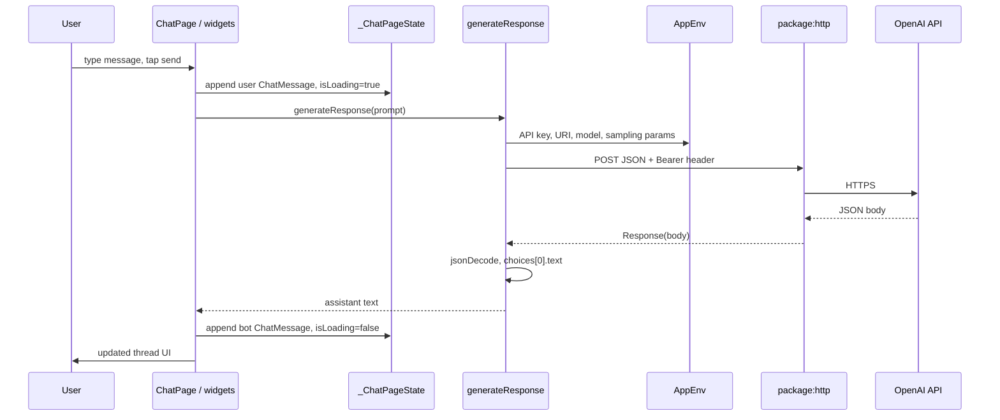

# Botler — Developer quickstart

Botler is a small **Flutter** app: a single chat screen sends the user’s text to **OpenAI’s HTTP API** (Completions-style request/response) and shows the returned text. Use this repo as a **starting point** for your own mobile LLM client.

Planning notes for this README live in [`docs/botler_quickstart_plan.md`](docs/botler_quickstart_plan.md).

---

## Flutter in one minute (you don’t need prior Flutter experience)

**What Flutter is:** an **open-source UI toolkit and SDK** from Google. You write **Dart** under `lib/`; Flutter compiles your app to **native iOS and Android binaries** (and optionally desktop/web). **Using Flutter costs nothing** — no Flutter subscription. Your separate bill is vendors like **OpenAI**, where usage is metered.

**Why Botler uses it:** one codebase drives **mobile + desktop + web** from the same chat logic and HTTP client. That fits an LLM demo/starter that might ship on an **iPhone first** but stay portable.

**What Flutter is *not* (common confusion):**

| Myth | Reality |
|------|---------|
| “Flutter *is* the AI” | No — Flutter draws UI and runs Dart. **OpenAI’s HTTP API** does generation. |
| “Flutter is a website host” | Not primarily — `web/` is optional build output; most teams mean **installed apps**. |
| “Flutter is a connector product” | No separate connector — your Dart code calls HTTPS endpoints with normal REST clients (`package:http` here). |

Install tooling and follow tutorials via **[Flutter documentation](https://docs.flutter.dev/)**. Lower in this README, **Toolchain → Flutter SDK + Dart** repeats technical specifics (inputs/outputs, what you edit) in workflow order.

---

## Implemented today vs extension path

| Aspect | Implemented in code | Extension path (you build it) |
|--------|----------------------|-------------------------------|
| **LLM backends** | **OpenAI only**, one POST per send | Add services for other APIs; route from UI or a facade |
| **Prompting** | Raw user string → JSON `prompt` field | Templates, system prompts, chat-style messages |
| **Search / RAG** | Not present | Call search or embeddings **before** building the prompt |
| **Recommendations** | Not present | Use history/profile to change inputs to the model |
| **Deep / multi-step flows** | Single request/response | Orchestrate multiple calls / tools in Dart |

---

## Working in this repository

You can develop Botler primarily in **one editor** — for example **VS Code** or **Cursor** — with the **Flutter** and **Dart** extensions installed. You run builds from a terminal (`flutter pub get`, `flutter run`, …).

Most changes belong in **`lib/`** (Dart). You do **not** need to live inside Xcode day to day; open Xcode mainly for **signing**, **capabilities**, or **iOS-specific debugging**.

---

## Native code folders vs `lib/`

Flutter ships your Dart code inside **platform-specific shells**. That is why you see:

| Technology | Typical location | Why it exists |
|------------|------------------|----------------|
| Swift / Objective-C / Xcode projects | `ios/` | iOS app host, signing, Info.plist, CocoaPods output |
| Kotlin / Gradle | `android/` | Android host |
| CMake / C++ | `linux/`, `windows/` | Desktop glue |
| HTML / manifest | `web/` | Web bootstrap |

Those files are mostly **generated or maintained by Flutter tooling**. Unless you are integrating a **native SDK** or fixing platform configuration, **treat `lib/` as the source of truth** for product behavior.

---

## How Botler works (architecture)

Thin layers, bottom to top:

1. **Remote API** — OpenAI receives HTTPS POSTs; returns JSON.
2. **Transport** — Dart `package:http` performs the POST.
3. **Configuration** — `AppEnv` resolves URL, model, sampling params, and API key from `.env.local` / `--dart-define` (`lib/env/`).
4. **Networking helper** — `generateResponse()` in `lib/main.dart` builds JSON and parses the completion text.
5. **UI state** — `_ChatPageState` holds `List<ChatMessage>` and `isLoading`.
6. **Presentation** — Flutter widgets (`ChatPage`, `ChatMessageWidget`, `MaterialApp`) render the thread.

There is **no separate backend service** in this repo — the app talks **directly** to OpenAI from the device/simulator (subject to your networking and key-handling choices for production).

---

## End-to-end data flow (one send)

Sequential path through the running app:

1. User types in the `TextField` (`_textController`) on **`ChatPage`** (`lib/main.dart`).
2. User taps send → **`_buildSubmit`** `onPressed` runs.
3. **`setState`** appends a **`ChatMessage`** with `ChatMessageType.user` (`model.dart`) and sets **`isLoading = true`**.
4. The raw input string is copied out (then the field is cleared).
5. **`generateResponse(input)`** runs asynchronously (`lib/main.dart`).
6. **`AppEnv.openAiApiKey`** and related getters read secrets/settings (`lib/env/app_env.dart`); empty key → **`StateError`**.
7. **`http.post`** sends JSON (`model`, `prompt`, temperature, token limits, …) and **`Authorization: Bearer …`** to **`AppEnv.openAiCompletionsUri`**.
8. **OpenAI** responds with HTTP + JSON body (errors are **not** specially handled in this demo code).
9. **`jsonDecode`** parses the body; code reads **`responseJson['choices'][0]['text']`** as the assistant string.
10. **`generateResponse`** returns that string to the `.then` callback on the send handler.
11. **`setState`** sets **`isLoading = false`** and appends a **`ChatMessage`** with `ChatMessageType.bot`.
12. **`ListView.builder`** rebuilds with the new tail of **`_messages`**.
13. **`_scrollDown`** adjusts scroll toward the latest messages.

---

## Diagram (request path)



---

## Toolchain and dependencies (workflow order)

Order follows **how execution is wired**, not alphabetical listing.

### 1. Flutter SDK + Dart language

| | |
|--|--|
| **What it is** | Compiler, runtime, widget framework, and tooling (`flutter`, `dart`). Dart is the language you write in `lib/`. |
| **You edit it?** | No — install via OS/package manager; upgrade intentionally. |
| **Input / output** | Your Dart sources + assets → platform builds → runnable app. |
| **In repo** | Not vendored; implied by `pubspec.yaml` SDK constraint. |
| **Scope** | **All targets** (app logic + rendering). Flutter itself is **free/open source**; third-party APIs (OpenAI) are billed separately. |

### 2. `pubspec.yaml`, Pub, and `pubspec.lock`

| | |
|--|--|
| **What it is** | Declares package name, SDK bounds, **dependencies** (`flutter`, `http`, plugins), **assets**, and dev tooling. `flutter pub get` resolves versions; **`pubspec.lock`** pins them. |
| **You edit it?** | **Yes**, when adding/removing packages or registering assets. |
| **Input / output** | Declarations → downloaded packages under Pub cache; informs build. |
| **In repo** | [`pubspec.yaml`](pubspec.yaml), [`pubspec.lock`](pubspec.lock). |
| **Scope** | **Project-wide** dependency manifest (not iOS-specific). |

### 3. Application code (`lib/`)

| | |
|--|--|
| **What it is** | Your product: widgets, event handlers, HTTP helper (`generateResponse`), and env accessors. |
| **You edit it?** | **Yes — primary surface.** |
| **Input / output** | User gestures + async HTTP → UI updates + network I/O. |
| **In repo** | [`lib/main.dart`](lib/main.dart), [`lib/model.dart`](lib/model.dart), [`lib/env/`](lib/env/). |
| **Scope** | **App logic** on every platform. |

### 4. Environment configuration (`AppEnv`, `.env.local`, `--dart-define`)

| | |
|--|--|
| **What it is** | Loads **non-committed** `.env.local` on IO via [`lib/env/env_loader_io.dart`](lib/env/env_loader_io.dart); merges with compile-time **`String.fromEnvironment`** overrides in [`lib/env/app_env.dart`](lib/env/app_env.dart). Web skips file load (`kIsWeb`). |
| **You edit it?** | **Yes** — maintain **`.env.local`** locally; commit **`.env.example`** only as a template. Pass **`--dart-define=KEY=value`** when needed. |
| **Input / output** | Key/value strings → getters consumed by `generateResponse`. |
| **In repo** | [`.env.example`](.env.example), `.env.local` (**gitignored**). |
| **Scope** | **App logic / secrets** (web needs defines for keys). |

### 5. `package:http`

| | |
|--|--|
| **What it is** | Dart HTTP client used for **`http.post`**. |
| **You edit it?** | Indirectly — version pinned in `pubspec.yaml`; swap library only if you refactor networking. |
| **Input / output** | URI + headers + body → HTTP response stream/string. |
| **In repo** | Imported in [`lib/main.dart`](lib/main.dart). |
| **Scope** | **App logic** (transport); same code path on iOS/Android/desktop where IO sockets allowed. |

### 6. OpenAI HTTP API (remote service)

| | |
|--|--|
| **What it is** | Vendor-hosted REST API. Botler targets **Completions-style** JSON (`prompt`, `model`, …). |
| **You edit it?** | Not source — configure **account billing**, **models**, and **keys** in OpenAI’s dashboard. |
| **Input / output** | JSON request → JSON completion (`choices[0].text` as implemented). |
| **In repo** | Not vendored; URLs/keys surfaced via `AppEnv`. |
| **Scope** | **External backend / LLM**; **paid usage** per OpenAI pricing. |

### 7. Xcode + Apple SDKs + `ios/` Runner

| | |
|--|--|
| **What it is** | Builds/signs the **iOS host** that embeds Flutter; Simulator/device tooling. |
| **You edit it?** | Occasionally — signing, bundle ID, capabilities; avoid manual drift from Flutter’s expectations. |
| **Input / output** | Flutter build artifacts → `.app` / IPA. |
| **In repo** | [`ios/`](ios/) (e.g. `Runner.xcworkspace`, `Info.plist`). |
| **Scope** | **iOS packaging & Apple integration only.** |

### 8. CocoaPods

| | |
|--|--|
| **What it is** | iOS dependency manager; resolves native pods declared by Flutter plugins (`Podfile`). |
| **You edit it?** | Rarely (`Podfile`); usually run **`pod install`** after plugin changes. |
| **Input / output** | Pod specs → native libraries linked into `Runner`. |
| **In repo** | [`ios/Podfile`](ios/Podfile), generated `Pods/` (often gitignored). |
| **Scope** | **iOS native bridge** for Flutter plugins. |

### 9. Optional: `window_size` + desktop/web shells

| | |
|--|--|
| **What it is** | Desktop-only helper used to **`setWindowTitle`** in [`lib/main.dart`](lib/main.dart); irrelevant on pure iOS UX. |
| **You edit it?** | Usually no — declared in `pubspec.yaml`. |
| **Input / output** | Platform channel calls → native window metadata. |
| **In repo** | Declared in [`pubspec.yaml`](pubspec.yaml); desktop folders `macos/`, `windows/`, `linux/`, `web/`. |
| **Scope** | **Optional desktop/web** targets; **not required for iOS**. |

### 10. Minor: `cupertino_icons`

| | |
|--|--|
| **What it is** | Icon font package for Material/Cupertino hybrids. |
| **You edit it?** | Rarely. |
| **Input / output** | Asset font → icons in widgets if referenced. |
| **In repo** | [`pubspec.yaml`](pubspec.yaml). |
| **Scope** | **Cosmetic / UI assets.** |

---

## Customize into your own LLM app

Use **`extension`** rows as guidance — files may not exist until you create them.

| Goal | Today | Where to work |
|------|-------|----------------|
| **Swap LLM provider / URL / headers** | OpenAI-only via `generateResponse` | Primarily [`lib/main.dart`](lib/main.dart) (`generateResponse`); consider extracting `lib/services/openai_completion_service.dart` then add siblings per vendor. |
| **Change prompt format** | Raw user text → JSON `prompt` | Same function — wrap user text with templates; switch JSON schema if you move to **Chat Completions** / messages arrays. |
| **Add search or retrieval** | Not implemented | Before calling the LLM, add e.g. `lib/services/search_service.dart`; merge hits into the string passed as `prompt` or attach structured context. |
| **Add recommendations** | Not implemented | Persist signals (local DB, backend); compute candidate items in Dart; feed summaries or IDs into the prompt or a second scoring step. |
| **Deep-search / multi-step orchestration** | Single hop | Replace the single `generateResponse` call from UI with an **`Orchestrator`** (new Dart module): loop → branch → multiple HTTP calls → aggregate → final assistant text. |
| **User profile / context** | Not implemented | Store profile (secure storage / your API); inject into prompt-building layer above — **do not** hardcode PII into repo; thread minimal fields into the object that builds `prompt`. |

After splitting logic out of `main.dart`, keep **`ChatPage`** focused on **state + widgets**, and keep HTTP/env details in **services + `AppEnv`** (or a successor config layer).

---

## Repository layout (reference)

| Path | Role |
|------|------|
| **`lib/`** | Dart application — **start here**. |
| **`ios/`**, **`android/`**, **`macos/`**, **`windows/`**, **`linux/`**, **`web/`** | Platform hosts — edit sparingly. |
| **`assets/`** | Bundled images referenced from code (`pubspec.yaml` `flutter: assets:`). |
| **`test/`** | Tests (starter widget test may not match current UI). |
| **`docs/`** | Supplementary documentation (e.g. planning notes). |

---

## Configure your OpenAI API key

1. Create a key: [OpenAI API keys](https://platform.openai.com/api-keys).
2. Enable billing suitable for API usage: [pricing](https://openai.com/api/pricing/).
3. Locally: `cp .env.example .env.local` and set **`OPENAI_API_KEY`** (never commit `.env.local`).
4. CI / web / scripted builds: pass **`--dart-define=OPENAI_API_KEY=...`** (non-empty defines override file values — see `lib/env/app_env.dart`).
5. Device needs outbound HTTPS to your configured API host (default **`api.openai.com`**).

---

## Before you run (prerequisites & checks)

**All platforms (iOS, Android, desktop)**

- **Flutter SDK** on your `PATH` — install guides: [macOS](https://docs.flutter.dev/get-started/install/macos), [Windows](https://docs.flutter.dev/get-started/install/windows), [Linux](https://docs.flutter.dev/get-started/install/linux).
- **OpenAI**: API key + **billing** suitable for API usage.
- Run **`flutter doctor -v`** and fix ✗ for the platform(s) you target.
- **`.env.local`**: copy from [`.env.example`](.env.example); run **`flutter run` from the repo root** so `.env.local` is found on mobile/desktop (**IO** builds). **Web** still needs **`--dart-define`** for secrets.

**iOS only**

- **macOS** with **Xcode** (Simulator or device).
- **CocoaPods** — used only for **`pod install`** under **`ios/`** (Android does not use CocoaPods).

**Android only**

- **Android SDK** + emulator or USB device; **`flutter doctor`** should report Android toolchain OK.
- Accept SDK licenses if prompted: **`flutter doctor --android-licenses`**.

**Optional**

- **New to Flutter?** — [Write your first Flutter app](https://docs.flutter.dev/get-started/codelab).

---

## After you clone: terminal-first run

Cloning only downloads files — **nothing opens until `flutter run`**.

For **local development**, **don't** install Botler from the App Store or Play Store — **build from source** with **`flutter`** in a terminal (SDK + `PATH` once: [Install Flutter](https://docs.flutter.dev/install)).

**Same terminal**, repo root after `cd`:

```bash
flutter --version              # SDK on PATH
flutter doctor -v              # fix ✗ once

git clone git@github.com:tinarezvanian/botler.git   # skip if cloned already
cd botler

flutter pub get                # deps from pubspec.yaml

cp .env.example .env.local
# Edit .env.local — OPENAI_API_KEY=sk-...

flutter devices                # copy a Device Id for next line

# iOS only when needed:
# cd ios && pod install && cd ..

flutter run -d <id>            # table below — macos | chrome | emulator string…
```

**Same terminal:** logs + hot reload. **New window:** Botler UI (Simulator / emulator / desktop / Chrome depends on `<id>`).

| `<id>` | Opens |
|--------|--------|
| `macos` | Desktop *(enable once: `flutter config --enable-macos-desktop`)* |
| `chrome` | Browser *(use `--dart-define=OPENAI_API_KEY=...`)* |
| Other ids from `flutter devices` | Phone emulator / physical device |

Then **iOS-specific** / **Android-specific** below for **`pod install`**, signing, releases.

---

## Run Botler — shared setup

See **[After you clone: terminal-first run](#after-you-clone-terminal-first-run)** — clone → `pub get` → `.env.local` → `devices` → `run`.

---

### iOS-specific steps

```bash
cd ios && pod install && cd ..
flutter run -d <simulator-or-device-id>
```

Physical device: open **`ios/Runner.xcworkspace`** → **Signing & Capabilities** → Team + Bundle ID.

Release:

```bash
flutter build ipa --dart-define=OPENAI_API_KEY=...
```

---

### Android-specific steps

No **`pod install`**. From the repo root (after **shared setup**):

```bash
flutter run -d android
# or: flutter run -d <device-id>
```

If Gradle or plugin caches behave oddly after pulling changes:

```bash
flutter clean
flutter pub get
flutter run -d android
```

Release (example):

```bash
flutter build apk --release --dart-define=OPENAI_API_KEY=...
```

---

## Common issues

| Symptom | Likely cause | What to try |
|---------|----------------|-------------|
| **`StateError` about `OPENAI_API_KEY`** | Key missing or empty | Set key in **`.env.local`** or pass **`--dart-define=OPENAI_API_KEY=...`**. On **web**, use defines — file-based `.env.local` is not loaded like IO. |
| **`pod install` fails** *(iOS only)* | CocoaPods / Ruby / repo state | From `ios/`: `pod repo update`, retry `pod install`; confirm Xcode Command Line Tools (`xcode-select -p`). |
| **Physical device: won’t install** *(iOS only)* | Signing | Open **`ios/Runner.xcworkspace`** → **Signing & Capabilities** → valid **Team** + unique **Bundle ID**. |
| **Android build / Gradle odd failures** | Stale build cache after upgrades | From repo root: **`flutter clean`**, **`flutter pub get`**, then **`flutter run -d android`**. |
| **Hang after send / no assistant bubble** | Demo code has **minimal error handling** | Check **Logcat** (Android) or Xcode **device logs** (iOS) / console; confirm **model + endpoint** match (`OPENAI_MODEL`, `OPENAI_COMPLETIONS_PATH`) and HTTP status in debugger. |
| **Parse / cast errors on response** | Response shape ≠ Completions (`choices[0].text`) | Align parser in [`lib/main.dart`](lib/main.dart) with the API you call (e.g. Chat Completions uses `choices[0].message.content`). |
| **Timeouts or TLS failures** | Network / firewall | Confirm device reaches **`api.openai.com`** (or your overridden host); corporate proxies may block direct API access. |

**Production note:** Putting API keys **only** in the client is convenient for demos but risky for shipping; many teams proxy LLM calls through **their own backend** and keep secrets server-side.

---

## OpenAI JSON shape (parser location)

Botler assumes **Completions-like** responses and reads **`choices[0]['text']`** in [`lib/main.dart`](lib/main.dart).

If you switch OpenAI product shapes (**Chat Completions**, Responses API, …), update **both** the **request JSON** and the **parser** together.

---

## Security

- Treat leaked keys as compromised — revoke and rotate in OpenAI’s dashboard.
- Never commit **`.env.local`** or live keys.

---

## Further reading

- [Flutter install — custom setup](https://docs.flutter.dev/install/custom) (Android emulator / device + SDK paths vary by host OS)
- [Flutter — iOS setup on macOS](https://docs.flutter.dev/get-started/install/macos#ios-setup)
- [Flutter deployment — iOS](https://docs.flutter.dev/deployment/ios)
- [Flutter deployment — Android](https://docs.flutter.dev/deployment/android)
- [OpenAI API reference](https://platform.openai.com/docs/api-reference)
